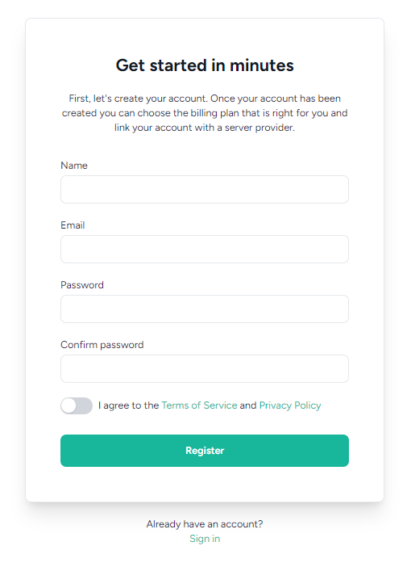

# 계정 생성

`https://forge.laravel.com` 사이트에 접속하여 우측 상단에 있는 "Sign in" 버튼을 클릭합니다.

<figure><figcaption></figcaption></figure>

Name (이름) / Email (이메일) / Password (비밀번호) / Confirm password (비밀번호 확인) 입력을 한 후 Register 버튼을 클릭합니다.

<figure><figcaption></figcaption></figure>

해당 페이지가 나온다면 정상적으로 회원가입이 완료가 된 상태입니다.
